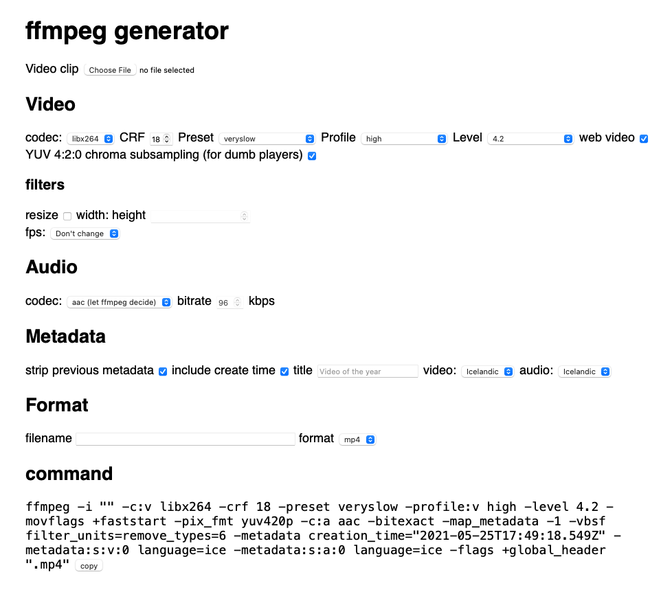

# ffmpeg.haukurh.dev

Online tool to build ffmpeg commands for optimized videos 

## Test it out

You can go to [ffmpeg.haukurh.dev](https://ffmpeg.haukurh.dev) to test it out!

## Raw and beautiful

The tool is really raw at this point but does it job.

## How it works

For now, it's main focus is delivering commands that are for video which are optimized for the web.

You can drag your video file into the input field, then the web app will get the filename and in case of mp4's it will
get some metadata as well with the use of [moov-atom-js](https://github.com/haukurh/moov-atom-js) library.

## ToDo list

- [ ] Support command with hardware acceleration, such as nvidia
- [ ] Do some CSS magic
- [ ] Optimize JS
